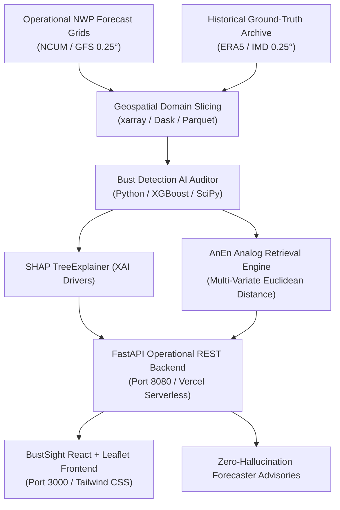

# BustSight | AI-Based Weather Forecast Bust Detection System

<div align="center">


</div>

---

## 🌟 Executive Summary

**BustSight** is an operational **AI Auditor Meta-Layer** developed for the **National Centre for Medium Range Weather Forecasting (NCMRWF)** under the **Ministry of Earth Sciences (MoES)** for **SIH 2026 Problem Statement 26079**.

Medium-range numerical weather prediction (NWP) models (such as NCUM and GFS) sometimes experience severe localized errors during rapidly evolving extreme weather events—known as **"Forecast Busts"**. These failures during monsoon depressions, cyclones, heatwaves, and mountain cloudbursts lead to costly operational decision errors.

**BustSight** evaluates operational Day 1–10 forecast grids against 25 years of historical ground-truth data (ERA5 reanalysis and IMD 0.25° grid observations), computes localized failure probabilities ($0-100\%$), draws GeoJSON bounding boundaries over volatile regions, and explains the meteorological root cause using **SHAP TreeExplainer XAI**—with guaranteed zero LLM hallucination.

---

## ✅ NCMRWF Mandated Outcomes (100% Native Coverage)

| Mandated Outcome | Description | Technical Implementation | Status |
| :--- | :--- | :--- | :---: |
| **1. Forecast Confidence Map** | Region-wise confidence index for Day 1 to Day 10 forecasts | Interactive Leaflet map over India domain ($6^\circ-38^\circ\text{N}, 66^\circ-100^\circ\text{E}$) | **COMPLETE** |
| **2. Forecast Bust Probability** | Failure probability indicator over different regions | Quantitative bust risk gauge (%) and lead-time decay curve | **COMPLETE** |
| **3. Error-Prone Zone Isolation** | Identification of areas where model forecast is unreliable | Automated GeoJSON polygon bounding boundaries | **COMPLETE** |
| **4. Explainable Output (XAI)** | Key meteorological reasons for low model confidence | XGBoost SHAP TreeExplainer thermodynamic driver weights | **COMPLETE** |
| **5. Prototype Dashboard / REST API** | Simple interface for duty forecaster operational use | React.js duty forecaster dashboard + Python FastAPI REST backend | **COMPLETE** |

---

## 🏛️ System Architecture



---

## 💡 Key Technical Innovations

1. **Bust Fingerprinting:** Categorizes model failures into 5 distinct meteorological archetypes:
   - `Monsoon Depression Track & Velocity Displacement`
   - `Western Disturbance Orographic Track Deviation`
   - `Convective Precipitation Underestimation (Mesoscale Surge)`
   - `Heatwave Ridge Intensity & Persistence Error`
   - `Post-Monsoon Cyclone Rapid Intensification Breakdown`
2. **SHAP Attribution Framework:** Extracts deterministic mathematical feature weights causing model divergence (e.g. 500hPa geopotential height anomaly $+0.385\text{ gpm}$, 850hPa wind shear deviation $+0.294\text{ m/s}$).
3. **Zero-Hallucination Advisories:** Translates deterministic SHAP values into plain-English forecaster warnings without LLM hallucination.
4. **Instant Analog Retrieval (AnEn System):** Calculates multi-variate Euclidean distances across historical ERA5 dataset archives ($2000-2025$) to instantly surface top precedents (e.g. *Cyclone Biparjoy 2023*, *Uttarakhand Cloudburst 2021*).

---

## 🛠️ Technology Stack

- **Frontend Interface:** React.js, Vite, Tailwind CSS, Leaflet (React-Leaflet), Recharts, Lucide Icons
- **Backend REST API:** Python 3, FastAPI, Uvicorn, Pydantic, NumPy
- **ML & Explainability:** XGBoost, SHAP TreeExplainer, SciPy
- **Data Engineering:** xarray, Dask, ERA5 Reanalysis, IMD 0.25° Grid Datasets
- **Deployment:** Vercel Serverless Functions (`api/index.py` & `vercel.json`)

---

## 💻 Local Setup & Installation

### Prerequisites
- Node.js (v18+) & npm
- Python 3.9+

### 1. Clone Repository
```bash
git clone https://github.com/manoj17-08/BustSight.git
cd BustSight
```

### 2. Install Dependencies
```bash
# Install Node.js frontend packages
npm install

# Install Python backend packages
pip install -r requirements.txt
```

### 3. Run Application
Run the Python FastAPI backend:
```bash
python3 server.py
# Server runs on http-[#127.0.0.1:8080]
```

In a new terminal window, run the Vite React frontend:
```bash
npm run dev
# Dashboard opens on http-[#localhost:3000]
```

---

## 🚀 Vercel Deployment Guide

BustSight comes pre-configured with Vercel Serverless Python support.

1. Push code to GitHub:
   ```bash
   git add .
   git commit -m "Update README and Vercel setup"
   git push origin main
   ```
2. Import project into [Vercel](https://vercel.com/new).
3. Vercel will automatically build the Vite React frontend and deploy the Python FastAPI backend serverless endpoints via `api/index.py`!

---

## 👥 Team Infex (SIH 2026 Team ID: 138755)

- **Problem Statement:** 26079 — AI-Based Forecast Bust Detection for Medium-Range Weather Forecasts
- **Organization:** Ministry of Earth Sciences (MoES) / NCMRWF
- **Category:** Software | **Theme:** Smart Automation

---

## 📄 License

Distributed under the MIT License. See `LICENSE` for more information.
